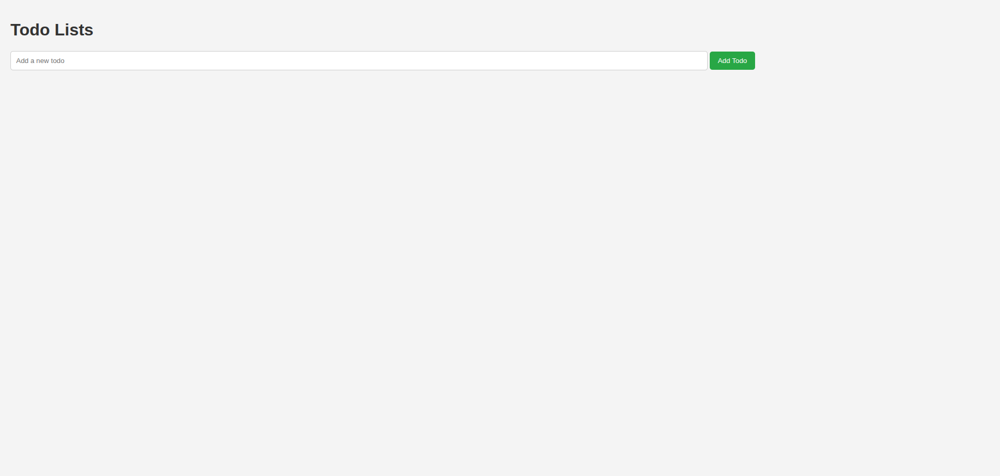
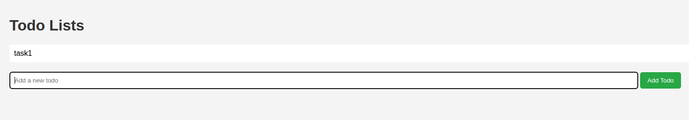
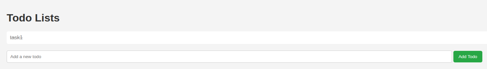
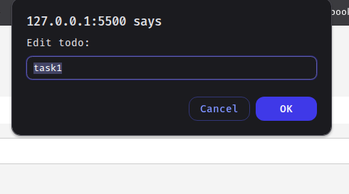
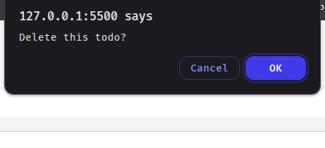

# 📝 Simple Todo App

A lightweight, interactive Todo application built using plain JavaScript and HTML. This app helps you manage your daily tasks with ease.

## 🚀 Features

- ✅ **Add Tasks** – Easily add new tasks using the input field.
- ✔️ **Mark as Completed** – Click on any task to toggle its completed status.
- 🖊️ **Edit Tasks** – Double-click on a task to edit its text.
- 🗑️ **Delete Tasks** – Right-click (or long press on touch devices) and confirm to delete a task.
- 🎯 **Instant Interaction** – All actions happen instantly in the browser without any reloads.

## 📸 Screenshots

### 1. App Interface

### 2. Add Task

### 3. Complete Task

### 4. Edit Task

### 5. Delete Task

## 📂 How to Use

1. Open the app in your browser.
2. Type a task into the input field.
3. Press **Enter** or click submit to add it to the list.
4. Click a task to mark it complete.
5. Double-click to edit.
6. Right-click to delete.

## 💡 Tech Used

- Vanilla JavaScript
- HTML5
- Minimal CSS

## 📄 License

This project is open source and free to use.
